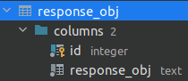
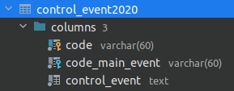

# SP_project

Данный ReadMe предназначен для разработчиков парсеров.

Для работы с базой данных(далее - БД) я написал для вас следующие классы:

## SPTable

Данный класс предназначен для простых таблиц БД, имеющих два атрибута, таких как ID(типа Integer) и Title(типа Text или
Varchar), т.к. таких таблиц достаточно много в БД.

### Импорт класса

Для взаимодействия с данным классом необходимо в самом парсере его импортировать

```Python 
from PyScripts.TableClasses.PublicClasses.SPTable import SPTable
```

### Объявление

Для того, чтобы работать с самим классом, необходимо объявить его объект.
Класс SPTable принимает следующие аргументы:

* <b>table_name</b> - Название таблицы в БД
* <b>table_title</b> - Название колонны <b>title</b> этой таблицы
* <b>cur</b> - объект для взаимодействия с БД (получается из parser_init())
* <b>conn</b> - аналогично cur
* <b>schema</b> - Необязательный аргумент, если вы работаете с таблицы из <b>public</b> схемы

### Методы класса SPTable

| Название метода          | Его устройство                                                                                     |
|--------------------------|----------------------------------------------------------------------------------------------------|
| <b>get_id_by_name(title) | Возвращает <b>id</b> объекта по его <b>title</b>, иначе <b>False</b>                               |
| <b>get_name_by_id(id)    | Возвращает <b>title</b> объекта по его <b>id</b>, иначе <b>False</b>                               |
| <b>add(title)            | Проверяет на наличие и вносит новое значение в таблицу, вовращает <b>id</b> объекта в любом случае |
| <b>delete(title/id)      | Удаляет значение из таблицы по <b>title</b> или <b>id</b>(по <b>id</b> желательно)                 |
| <b>commit()              | Подтверждение изменений, таких как <b>add</b> и <b>delete</b>                                      |

### Использование - пример

Возьмем в пример часто используемую таблицу ответственных объектов(с департаментами).
Её структура выглядит следующим образом:



Мы понимаем, что она подходит условиям класса SPTable и создаем объект этого класса
(не заполняем аргумент <b>schema</b>, т.к. она <b>public</b>)

```Python 
ResponseObj = SPTable('response_obj', 'response_obj', cur, conn)
```

Внести новый объект в таблицу можно так:

```Python 
ResponseObj.add(title)
```

ВАЖНО: Метод add проверяет на наличие данный объект в таблице, и НЕ будет его вносить, если он там уже присутствует.
А <b>id</b> будет прописан АВТОМАТИЧЕСКИ

Если нам необходим id созданного объекта, мы можем после добавления ее получить с помощью метода
<b>get_id_by_name(title)</b> или же сразу получить при внесении в таблицу:

```Python 
id = ResponseObj.add(title) # Получили id сразу
id = ResponseObj.get_id_by_name(title) # Получили id через метод
```

С помощью же <b>get_name_by_id(id)</b> мы можем получить <b>title</b> объекта по <b>id</b>

```Python 
title = ResponseObj.get_name_by_id(id)
```

## SPTableArbitrary

Данный класс является дочерним по отношению к SPTable и перенимает часть функций из него.
А часть функций переопределяет. Так как он написан для того, чтобы работать с любыми другими таблицами независимо от их
сложности.

### Импорт класса

Для взаимодействия с данным классом необходимо в самом парсере его импортировать

```Python 
from PyScripts.TableClasses.PublicClasses.SPTableArbitrary import SPTableArbitrary
```

### Объявление

Для того, чтобы работать с самим классом, необходимо объявить его объект.
Класс SPTable принимает следующие аргументы:

* <b>table_name</b> - Название таблицы в БД
* <b>table_title</b> - Название колонны <b>title</b> этой таблицы
* <b>cur</b> - объект для взаимодействия с БД (получается из parser_init())
* <b>conn</b> - аналогично cur
* <b>schema</b> - Необязательный аргумент, если вы работаете с таблицы из <b>public</b> схемы

### Методы класса SPTableArbitrary

| Название метода          | Его устройство                                                                                      |
|--------------------------|-----------------------------------------------------------------------------------------------------|
| <b>get_id_by_name(title) | Возвращает <b>id</b> объекта по его <b>title</b>, иначе <b>False</b>                                |
| <b>get_by_id(id)         | Возвращает список всех элементов объекта по его <b>id</b>, иначе <b>False</b>                       |
| <b>add(title)            | Проверяет на наличие и вносит новое значение в таблицу, возвращает <b>id</b> объекта в любом случае |
| <b>delete(title/id)      | Удаляет значение из таблицы по <b>title</b> или <b>id</b>(по <b>id</b> желательно)                  |
| <b>commit()              | Подтверждение изменений, таких как <b>add</b> и <b>delete</b>                                       |
| <b>get_name_by_id(id)    | <b>НЕ РАБОТАЕТ ДЛЯ ДАННОГО КЛАССА И ВЫЗОВЕТ ОШИБКУ, ЧТО ЗАВЕРШИТ ПРОГРАММУ                          |

### Использование - пример

Возьмем в пример таблицу контрольных событий за 2020 год отрасли Развития образования.
Её структура выглядит следующим образом:



Мы понимаем, что она не удовлетворят условиям класса SPTable и создаем объект класса SPTableArbitrary
(заполняем аргумент <b>schema</b>, т.к. она из <b>Education</b>)

```Python 
ControlEvent2020 = SPTableArbitrary('control_event2020', 'control_event', cur, conn, schema='Education')
```

Внести новый объект в таблицу можно так:

```Python 
ControlEvent2020.add(id, title1, title2, title3...)
```

ВАЖНО: Метод add проверяет на наличие данный объект в таблице, и НЕ будет его вносить, если он там уже присутствует.
А <b>id</b> НЕ будет прописан АВТОМАТИЧЕСКИ

Если нам необходим id созданного объекта, мы можем после добавления ее получить с помощью метода
<b>get_id_by_name(title)</b> или же сразу получить при внесении в таблицу:

```Python 
id = ControlEvent2020.add(id, title1, title2, title3...) # Получили id сразу
id = ControlEvent2020.get_id_by_name(title) # Получили id через метод
```

С помощью же <b>get_by_id(id)</b> мы можем получить список элементов объекта по <b>id</b>

```Python 
title = ResponseObj.get_name_by_id(id)
```

ВАЖНО: <b>get_name_by_id(id)</b> НЕ работает для данного класса и выдаст ошибку

### По любым вопросам писать касательно этих классов и кода писать https://vk.com/g4st3r7

#### В дальнейшем эти классы будут дорабатываться и обновляться.

#### Спасибо за внимание и приятного кодинга)
